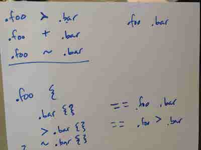

Wait, some people have said this. But I'd like to politely voice the opinion that they are wrong.

For almost two months, I have been working on a complex React project involving a complex SCSS implementation. I am new to such complex projects, and so have only just begun to really learn about what SCSS can do. And... there is a _lot_ to learn. But, it is a beautiful mess ❤️

Before diving into the project two months ago, I refreshed my awareness of [Sass basics](https://sass-lang.com/guide). Then, I opened the project code in my text editor, and jumped in. I was dazzled by the lines and lines of multi-coloured code, immediately puzzled when I saw countless @ $ _ and, something I hadn't expected - functions. Up until now, I hadn't written much of my own SCSS, and to be honest, I still haven't. However, I am proud that I wrote a fully-functioning each loop in SCSS last week :)

I was actually inspired to write this article after another fairly long struggle trying to style a component. I had to add a focus state to a custom checkbox. This seemingly simple task led me down a few rabbit holes. I learned a lot about the difficulties of styling a custom checkbox (i.e. one that is not browser-implemented).

<figure class="figure__border">
<a href="https://developer.mozilla.org/en-US/docs/Learn/HTML/Forms/The_native_form_widgets"></a>
<figcaption>^ Browser-implemented checkbox styles</figcaption>
</figure>

<figure class="figure__border">
<a href="http://wtfforms.com/"></a>
<figcaption>^ The custom checkbox style I wanted</figcaption>
</figure>

After reading a few articles and finding lots of similar but differing opinions, I asked another developer, [Nevan](http://nevanscott.com/), to come and help me.

```
.cp-#{$type}__input:focus {
    ~ .cp-#{$type}__dummy {
        border-color: cp-get-color-action(cta);
    }
```
```
    ~ .cp-#{$type}__label {
        font-weight: 700;
    }
}
```

Above is code from the project. I knew I had to work on this specific piece of code in order to get a focus state on the checkboxes. See the little tildes (**~**)? Nevan pointed out to me that these can be used as a special CSS selector, making the [general sibling combinator](https://developer.mozilla.org/en-US/docs/Web/CSS/General_sibling_selectors) possible.



We talked through different CSS selectors and Nevan drew some out for me. Once I'd learned what the general sibling combinator does, I was able to write the below code, which gave me a nice focus state for my checkbox:

```
.cp-#{$type}__input:checked:focus {
    ~ .cp-#{$type}__dummy {
        box-shadow: 0 0 0 0.075rem cp-get-color(base), 0 0 0 0.2rem cp-get-color-action(cta);
}  
```

I have come to realise that a lovely side-effect of working on a large project & using SCSS has been an increasing awareness of how & where to implement accessibility. I will write about this in another blog post. One thing I gained a stronger awareness of (simply from working with checkboxes) is that it's important to progressively enhance UI components, so that a fancy custom one is able to fall back to the default browser styles and functionality. This way, a user can still access the UI if JavaScript or CSS fail.

In conclusion to my first two months on a big project, I now know that getting confused, spending a long time studying many different files & folders, and asking other developers for help is a right of passage to becoming a better developer. I completed [CSS Diner](https://flukeout.github.io/) a long time ago. However, nothing increases your learning power more than working on something big, real, confusing and frustrating ;)