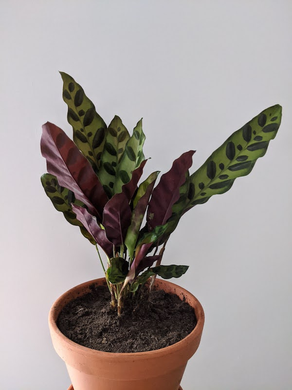

Bought June 2020!

This plant is known as a prayer plant. This means it lowers its leaves in daytime and folds them up high at night! Just like it is praying. I love its spotty, long leaves with the red undersides.

