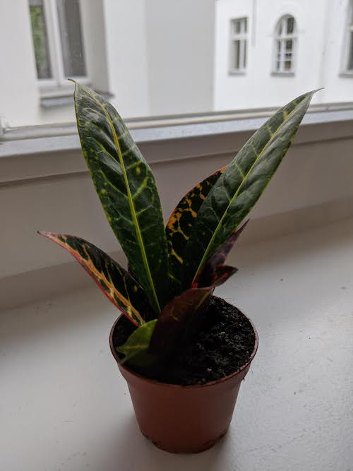

Boughy July 2020!

This baby only cost 2 euros, so I couldn't just leave it there in the store. The adult plant grows much bigger and keeps its amazing colourful leaves. Helping baby plants grow up and seeing how they grow is a nice change from buying an adult plant.

