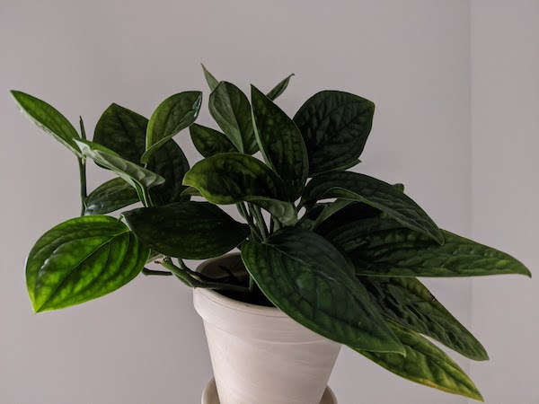

Bought May 2020!

This picture is from July 2020. In juts two months, it grew all the leaves that are pointing to the left. Almost 20 new leaves! The leaves are thick, shiny and a bit leathery. It seems really happy sitting near to a north-facing window with weekly watering. 

