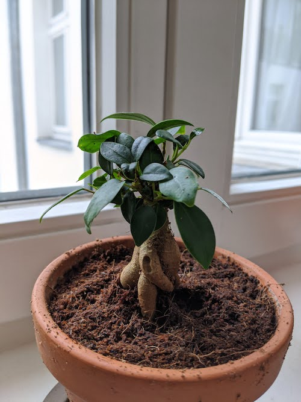

Bought June 2020!

I bought two of these babies from my local plant store. I want to compare how they grow! They grow slowly but will grow bigger. The bulky trunk part is actually roots that grow above the soil. Here is the baby with the curliest roots:

 