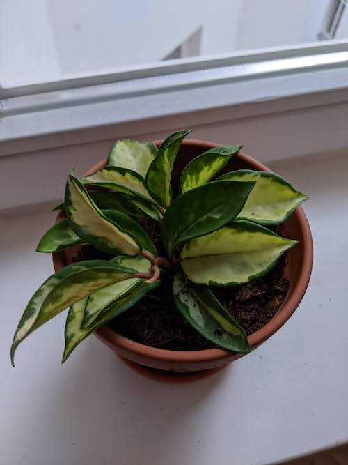
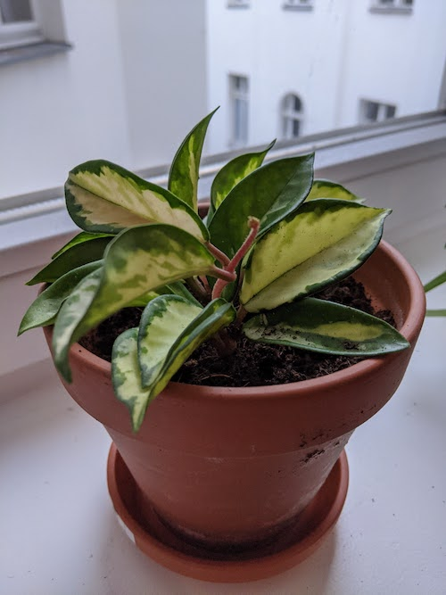

Bought May 2020!

Got this plant as a baby in May and by June it had grown 4 new leaves. It has soft, fuzzy red stalks that new leaves pop out from. The leaves are thick and a bit waxy, and the baby leaves are also soft.

