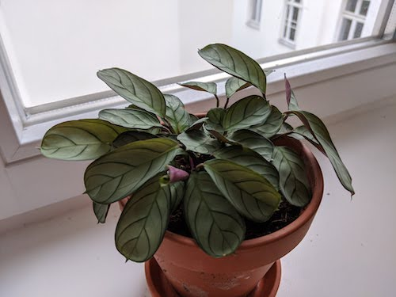
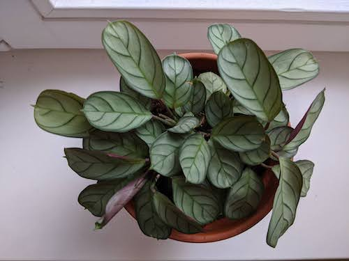

Bought May 2020!

I got this baby online and in two months it has pushed out quite a few new leaves! The leaves start out in scroll-like formations and soon unfurl to reveal their lovely minty and burgundy colours.

July 2020:

 

 