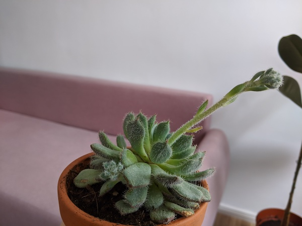
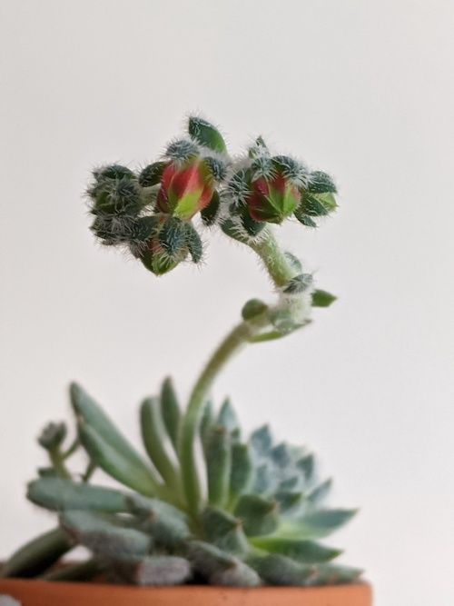

I got this cactus from an outdoor garden centre near my flat. I chose it amongst all the other catci because of its neat pattern of soft fuzzy leaves and minty-green colour. I had no idea what kind of cactus it was back then.

Within a couple of weeks it began to grow a long, thin (but sturdy) stem from its base. 

I spent some time online trying to find out what kind of cactus this one is. I found out its name is "Echeveria Setosa", otherwise known as the Mexican Firecracker. I love its informal name!

It is an evergreen succulent, originally from hot, dry climates.

Out of all my plants, it loves getting plenty of direct sun from my south-facing window. Although it can get sunburnt with too much sun. I also had to remove a few leaves on the bottom because I left them too wet and I think this had made them soft and unhappy.

To my delight, the long thin stem eventually developed a bunch of buds that I soon realised were developing flowers. Here's a picture of the developing flowers:

