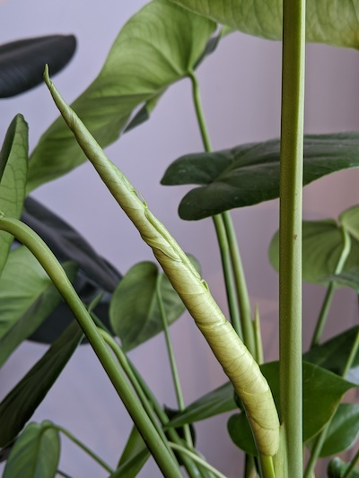

This is the plant I wanted when I first imagined getting indoor plants. It was one that had been talked fondly of by a former colleague of mine. She told me back then (a couple years ago) that she couldn't wait to get one. I know for a fact she has one now and it is quite magnificent.

I ordered mine online at the beginning of May from a company that would include good soil and a nice, well-draining pot. I wanted my Monstera to have the best start in life! And it would also be a month before any would appear in physical plant shops. If I had to buy another, I'd probably buy one from a physical plant shop.

Here is my Monstera when it first arrived:

Here is a close-up:

On May 25th I noticed one of two newly-forming curled-up leaves!

Here is a picture from June 3rd and as you can see the leaf is unfurling!

