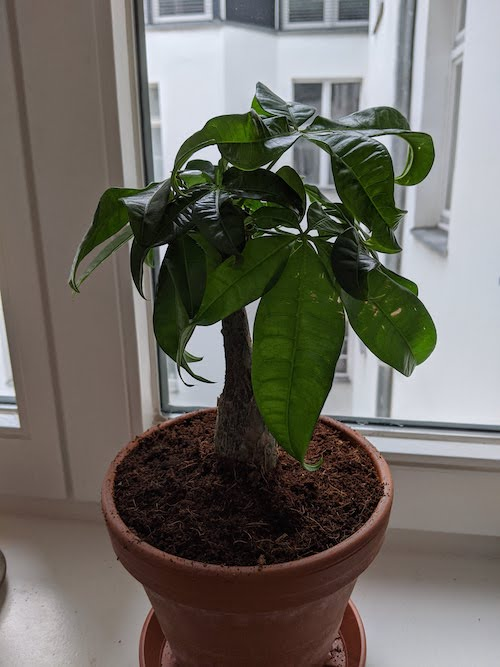

Bought June 2020!

I have a bigger version and a smaller version of this plant. The big one came first and this one has a typical trunk shape that has been created by twirling single strands of trunk around each other. That's a common thing to do with this plant. The second one is so sweet that I couldn't leave it behind. It has a thick, single trunk. I'm looking forward to seeing how it grows compared to its older sibling.

Small plant from the side:

 

Big plant from the top:

 