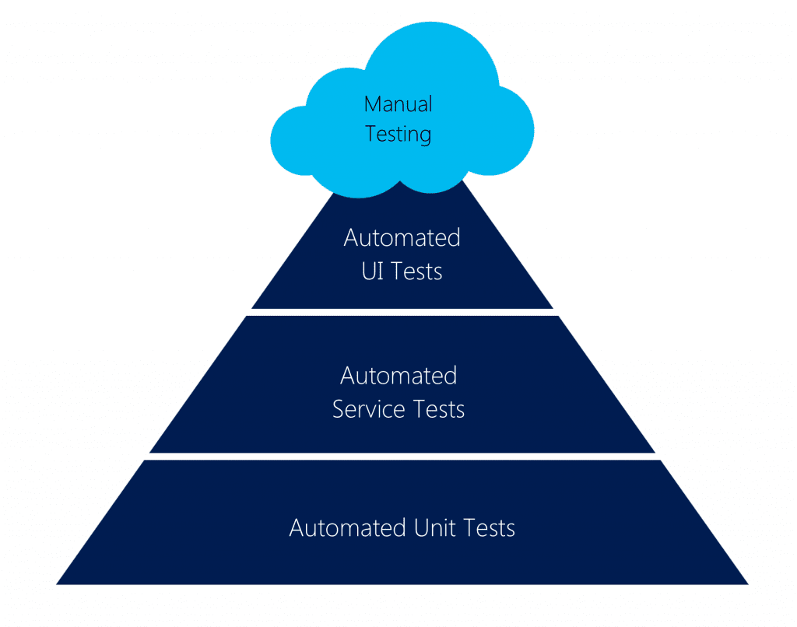

Today at work, we talked about test automation. One of the developers mentioned this quote:

> We cannot rely on mass inspection to improve quality, though there are times when 100 percent inspection is necessary. As Harold S. Dodge said many years ago, ‘You cannot inspect quality into a product.’ The quality is there or it isn’t by the time it’s inspected. - William E. Deming in _Out of the Crisis_

Therefore we cannot rely on creating features in a hurry, throwing them over the fence and then expecting our applications to work well and without bugs. To instil quality from the start of a feature, there should be tests for it.

Automated testing helps with this. Pre-commit hooks can be used when deploying builds so that errors are caught and addressed early. Unit tests can be run using pre-commit hooks - see my post on unit tests [here](https://amberwilson.co.uk/blog/unit-tests/). However, there is a fine line between having too many automated tests, e.g. end-to-end tests that take too long to run with each build, and not having enough. Some companies run quicker unit tests on each build, and then run end-to-end tests as a nightly build.

Please see the image below for one of many examples of the testing pyramid if you are confused when I mention unit tests or end-to-end (UI) tests:

Manual testing is important too. It is usually done by QA engineers, and helps reveal edge cases that automated tests do not catch. As one developer at my work said, these tests are like the cherry on top of the testing pyramid.
